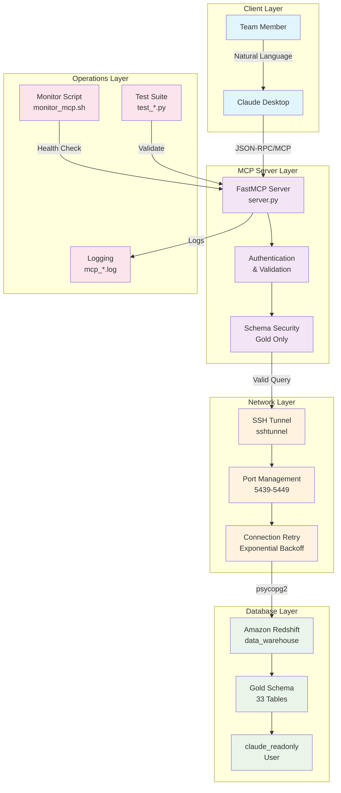

# Redshift MCP Server

This MCP (Model Context Protocol) server provides secure read-only access to Amazon Redshift databases for use with Claude Desktop.

## 🏗️ Architecture Overview

### System Architecture

```
┌─────────────────┐    ┌──────────────────┐    ┌─────────────────┐    ┌──────────────────┐
│   Claude        │    │   MCP Server     │    │   SSH Tunnel    │    │   Amazon         │
│   Desktop       │◄──►│   (FastMCP)      │◄──►│   (Optional)    │◄──►│   Redshift       │
│                 │    │                  │    │                 │    │   Cluster        │
└─────────────────┘    └──────────────────┘    └─────────────────┘    └──────────────────┘
        │                        │                        │                        │
        │                        │                        │                        │
   User queries              Query processing         Network tunnel           Data storage
   Natural language          Schema validation        Port forwarding        Read-only access
   Interface                 SQL execution            Security layer           Gold schema only
```

### Detailed Architecture Diagram



### Core Components

#### 1. **MCP Server (`server.py`)**
- **Purpose**: Main application server implementing Model Context Protocol
- **Technology**: FastMCP framework (Python)
- **Responsibilities**:
  - Receives queries from Claude Desktop via JSON-RPC
  - Validates and sanitizes SQL queries (SELECT only)
  - Manages database connections with retry logic
  - Enforces security restrictions (gold schema only)
  - Handles SSH tunnel lifecycle management

#### 2. **SSH Tunnel Layer (Optional)**
- **Purpose**: Secure connection to private VPC Redshift clusters
- **Technology**: SSHTunnelForwarder (Python sshtunnel library)
- **Features**:
  - Auto port discovery (5439-5449)
  - Connection retry with exponential backoff
  - Keep-alive mechanisms (20s intervals)
  - Graceful cleanup on shutdown

#### 3. **Database Layer**
- **Purpose**: Read-only access to Redshift data warehouse
- **Technology**: PostgreSQL protocol (psycopg2)
- **Security**: 
  - Read-only user (`claude_readonly`)
  - Schema restriction (gold schema only)
  - Query result limits (500 rows max)
  - Parameterized queries to prevent SQL injection

#### 4. **Monitoring & Management**
- **Purpose**: Health monitoring and automated recovery
- **Components**:
  - `monitor_mcp.sh`: Process monitoring and auto-restart
  - `test_stability.py`: Connection stability validation
  - Logging system with rotation

### Data Flow

```
1. User Query (Natural Language)
   ↓
2. Claude Desktop → MCP Server (JSON-RPC)
   ↓
3. Query Validation & Schema Security Check
   ↓
4. SSH Tunnel Establishment (if needed)
   ↓
5. Database Connection (with retry logic)
   ↓
6. SQL Execution (SELECT only, gold schema)
   ↓
7. Results Processing (max 500 rows)
   ↓
8. Response to Claude Desktop
   ↓
9. Natural Language Response to User
```

### Security Architecture

#### Multi-Layer Security Model

```
┌─────────────────────┐
│   Application       │  • Gold schema restriction
│   Security Layer    │  • Query type validation (SELECT only)
│                     │  • Row count limits (500 max)
└─────────────────────┘
┌─────────────────────┐
│   Network           │  • SSH tunnel encryption
│   Security Layer    │  • Bastion host access
│                     │  • VPC network isolation
└─────────────────────┘
┌─────────────────────┐
│   Database          │  • Read-only user permissions
│   Security Layer    │  • Schema-level access control
│                     │  • AWS IAM integration
└─────────────────────┘
```

### Connection Types

#### Direct Connection (Public Clusters)
```
Claude Desktop → MCP Server → Redshift (public endpoint)
```
- Use when: Redshift cluster is publicly accessible
- Configuration: `SSH_TUNNEL=false`

#### SSH Tunnel Connection (Private VPC)
```
Claude Desktop → MCP Server → SSH Tunnel → Bastion Host → Redshift (private)
```
- Use when: Redshift cluster is in private VPC
- Configuration: `SSH_TUNNEL=true` + SSH credentials
- Benefits: Enhanced security, VPC isolation

### Technology Stack

| Layer | Technology | Purpose |
|-------|------------|---------|
| **Interface** | Claude Desktop | Natural language query interface |
| **Protocol** | Model Context Protocol (MCP) | Communication standard |
| **Server Framework** | FastMCP (Python) | MCP server implementation |
| **Database Driver** | psycopg2 | PostgreSQL/Redshift connectivity |
| **SSH Tunneling** | sshtunnel + paramiko | Secure network tunnel |
| **Environment** | dotenv | Configuration management |
| **Monitoring** | Custom shell scripts | Health monitoring & recovery |

## Features

- **list_tables**: List all tables in a given schema
- **describe_table**: Get column names and types for a table  
- **query_data**: Run SELECT queries (read-only, max 500 rows)

## 🚀 Quick Start

### From GitHub Repository

```bash
# 1. Clone the repository
git clone https://github.com/your-org/redshift-mcp-server.git
cd redshift-mcp-server

# 2. Run automated setup
chmod +x setup.sh
./setup.sh

# 3. Configure your environment
# Edit .env with your Redshift credentials
cp .env.example .env  # Already done by setup.sh
# Edit .env with your actual values

# 4. Test connectivity  
source venv/bin/activate
python test_connection.py

# 5. Start the server
python server.py
```

### Manual Setup

If you prefer manual setup:

```bash
# Create virtual environment
python3 -m venv venv
source venv/bin/activate

# Install dependencies
pip install -r requirements.txt

# Configure environment
cp .env.example .env
# Edit .env with your credentials
```

## Setup Instructions

### 1. Install Dependencies

Make the setup script executable and run it:

```bash
chmod +x setup.sh
./setup.sh
```

Or manually:

```bash
# Create virtual environment
python3 -m venv venv
source venv/bin/activate

# Install dependencies
pip install -r requirements.txt
```

### 2. Configure Redshift Connection

Copy the example environment file and edit with your credentials:

```bash
cp .env.example .env
```

Edit the `.env` file with your Redshift cluster details:

**For Direct Connection (Public Redshift cluster):**
```env
RS_HOST=your-cluster.region.redshift.amazonaws.com
RS_DB=your_database_name
RS_USER=your_readonly_user
RS_PASS=your_password

# Disable SSH tunneling for direct connections
SSH_TUNNEL=false
```

**For SSH Tunnel Connection (Private VPC Redshift cluster):**
```env
RS_HOST=your-internal-cluster.region.redshift.amazonaws.com
RS_DB=your_database_name
RS_USER=your_readonly_user
RS_PASS=your_password

# SSH Tunnel configuration
SSH_TUNNEL=true
SSH_HOST=your-bastion-host.example.com
SSH_PORT=22
SSH_USER=ec2-user
SSH_KEY_FILE=/path/to/your/ssh-key.pem
# Optional: Use password instead of key file
# SSH_PASSWORD=your_ssh_password
# Local port for tunnel (default: 5439)
LOCAL_PORT=5439
```

**Security Note**: Use a read-only database user to minimize security risks.

### 3. Test Your Setup

First, test your connection:

```bash
source venv/bin/activate
python test_connection.py
```

### 4. Run the Server

```bash
source venv/bin/activate
python server.py
```

The server will start on `http://localhost:8000`

## Configure Claude Desktop

A sample configuration file (`claude_desktop_config.example.json`) has been created for you. 

Copy this content to your Claude Desktop configuration file:

**Mac**: `~/Library/Application Support/Claude/claude_desktop_config.json`

```json
{
  "mcpServers": {
    "redshift": {
      "command": "python",
      "args": ["/absolute/path/to/your/workspace/server.py"],
      "cwd": "/absolute/path/to/your/workspace",
      "env": {
        "RS_HOST": "your-cluster.region.redshift.amazonaws.com",
        "RS_DB": "your_database_name", 
        "RS_USER": "your_readonly_user",
        "RS_PASS": "your_password",
        "SSH_TUNNEL": "true",
        "SSH_HOST": "your-bastion-host.example.com",
        "SSH_PORT": "22",
        "SSH_USER": "your_ssh_username", 
        "SSH_KEY_FILE": "/path/to/your/ssh-key.pem",
        "LOCAL_PORT": "5439"
      }
    }
  }
}
```

**Important**: 
- Replace the placeholder values with your actual Redshift credentials
- Use absolute paths for `args` and `cwd`
- You can also use the `.env` file approach by omitting the `env` section

## Usage Examples

Once connected in Claude Desktop, you can:

```
List all tables in the public schema:
"Show me all tables in the database"

Describe a specific table:
"What are the columns in the users table?"

Query data:
"Show me the first 10 rows from the sales table"
"Get all customers from California"
```

## Security Features

- **Read-only**: Only SELECT queries are allowed
- **Row limit**: Results are capped at 500 rows
- **SQL injection protection**: Uses parameterized queries
- **Schema validation**: Validates table and schema names

## 🚨 Troubleshooting Guide

### Quick Diagnostics

```bash
# 1. Check server status
./monitor_mcp.sh status

# 2. Test connectivity  
python test_stability.py

# 3. View live logs
./monitor_mcp.sh logs
```

### Common Issues & Solutions

#### **🔌 Connection Issues**

**Problem**: "error opening tunnels" or intermittent failures
```bash
# Solution: Clean restart with enhanced stability
./monitor_mcp.sh clean
./monitor_mcp.sh start
python test_stability.py  # Verify fix
```

**Problem**: Port conflicts (5439 already in use)
```bash
# Diagnosis
lsof -i :5439

# Solution: Auto port discovery handles this
# Server will use ports 5440-5449 if 5439 is busy
```

#### **🔑 Authentication Issues**

**Problem**: SSH key authentication fails
```bash
# Check key permissions
chmod 600 ~/.ssh/id_rsa

# Test SSH connection directly
ssh -i ~/.ssh/id_rsa access@your-bastion-host

# Verify key path in .env
echo $SSH_KEY_FILE
```

**Problem**: Database authentication fails
```bash
# Test database credentials
python test_connection.py

# Check .env configuration
grep -E "RS_USER|RS_PASS|RS_HOST" .env
```

#### **🛡️ Security & Schema Issues**

**Problem**: Can access non-gold schemas (security concern)
```bash
# Test security restrictions
python test_restricted_access.py

# Should only return ["gold"] schema
```

**Problem**: "Access restricted to gold schema only" error
```bash
# This is expected behavior for non-gold schema access
# Update queries to use gold schema tables only
```

#### **⚡ Performance Issues**

**Problem**: Slow queries or timeouts
- Check query complexity and table size
- Verify network latency to Redshift cluster  
- Monitor SSH tunnel stability
- Consider query optimization

**Problem**: High memory usage
- Review query result set size (max 500 rows)
- Check for connection leaks in logs
- Monitor via `./monitor_mcp.sh status`

### **🔬 Advanced Diagnostics**

#### Log Analysis
```bash
# Server logs
tail -f mcp_server.log

# Monitor logs  
tail -f mcp_monitor.log

# Search for errors
grep -i error mcp_server.log
```

#### Network Diagnostics
```bash
# Test SSH tunnel manually
ssh -i ~/.ssh/id_rsa -L 5439:redshift-host:5439 access@bastion-host

# Test Redshift connectivity
telnet localhost 5439  # After SSH tunnel

# Check routing
traceroute your-redshift-host
```

#### Database Diagnostics
```bash
# Run permission analysis
python diagnose_permissions.py

# Test specific queries
python test_mcp_tools.py
```

### **📞 Getting Help**

1. **Check Logs**: Always start with `./monitor_mcp.sh logs`
2. **Run Tests**: Use test suite to isolate issues
3. **Clean Restart**: Try `./monitor_mcp.sh clean && ./monitor_mcp.sh start`
4. **Document Issues**: Note error messages and steps to reproduce
5. **Check Dependencies**: Verify all packages in `requirements.txt` are installed

### **🎯 Environment-Specific Notes**

#### Development Environment
- Use `SSH_TUNNEL=false` for local testing if Redshift is publicly accessible
- Test with `python test_connection.py` before full deployment

#### Production Environment  
- Always use `SSH_TUNNEL=true` for VPC-isolated Redshift clusters
- Use monitoring: `./monitor_mcp.sh monitor` for auto-restart
- Regularly check `python test_stability.py` for health verification

## Troubleshooting

> **Note**: For comprehensive troubleshooting, see the detailed [🚨 Troubleshooting Guide](#-troubleshooting-guide) section above.

### Quick Reference

## 📁 Project Structure

```
claud/
├── 🏗️ Core Application
│   ├── server.py                    # Main MCP server with FastMCP framework
│   ├── requirements.txt             # Python dependencies
│   └── .env                         # Environment configuration (NOT in git)
│
├── 🔧 Setup & Configuration  
│   ├── setup.sh                     # Automated environment setup script
│   ├── .env.example                 # Environment template (safe for git)
│   ├── claude_desktop_config.example.json # Claude Desktop config template
│   ├── .gitignore                   # Git ignore rules (security)
│   └── LICENSE                      # MIT license
│
├── 🧪 Testing & Validation
│   ├── test_connection.py           # Basic connectivity validation
│   ├── test_stability.py            # Connection stability testing (3 attempts)
│   ├── test_restricted_access.py    # Schema access security validation
│   ├── test_schemas.py              # Schema enumeration testing
│   └── test_mcp_tools.py           # MCP tool functionality testing
│
├── 📊 Monitoring & Management
│   ├── monitor_mcp.sh               # Process monitoring & auto-restart system
│   ├── restart_mcp.sh               # Quick cleanup & restart utility
│   ├── mcp_server.log               # Server runtime logs
│   └── mcp_monitor.log              # Monitoring system logs
│
├── 🔍 Diagnostics
│   ├── diagnose_permissions.py      # Database permission analysis
│   └── QUICK_REFERENCE.md           # Operational commands & troubleshooting
│
├── 📚 Documentation
│   └── README.md                    # This comprehensive guide
│
└── 🐍 Runtime Environment
    └── venv/                        # Isolated Python virtual environment
```

### Key Files Explained

#### **Core Application Files**
- **`server.py`**: Main MCP server implementing FastMCP protocol with SSH tunnel support, connection retry logic, and security restrictions
- **`.env`**: Sensitive configuration (DB credentials, SSH settings) - never commit to version control
- **`requirements.txt`**: Pinned Python dependencies for reproducible builds

#### **Testing Suite**
- **`test_stability.py`**: Validates connection reliability with retry mechanisms
- **`test_restricted_access.py`**: Ensures gold schema security restrictions work properly  
- **`test_connection.py`**: Basic connectivity smoke test

#### **Monitoring Tools**
- **`monitor_mcp.sh`**: Production-ready monitoring with auto-restart, health checks, and logging
- **`QUICK_REFERENCE.md`**: Operational runbook for team members

#### **Configuration Files**
- **`claude_desktop_config.example.json`**: MCP server registration template for Claude Desktop application
- **`.env.example`**: Environment template with placeholder values (safe for git)
- **`.gitignore`**: Comprehensive git exclusions for security and cleanliness
- **`setup.sh`**: One-command environment setup with dependency installation

## 🔐 Security Considerations

### Git Repository Security

This repository is designed to be **safely shared on GitHub** with the following security measures:

#### **Excluded from Git (via .gitignore):**
- ✅ `.env` - Contains real credentials and SSH keys
- ✅ `*.log` - May contain sensitive runtime information  
- ✅ `claude_desktop_config.json` - Contains actual credentials
- ✅ `*.pem`, `*.key` - SSH private keys
- ✅ `__pycache__/`, `venv/` - Runtime artifacts

#### **Safe Template Files (included in Git):**
- ✅ `.env.example` - Template with placeholder values
- ✅ `claude_desktop_config.example.json` - Configuration template
- ✅ All source code and documentation
- ✅ Test scripts and monitoring tools

#### **Team Setup Process:**
1. **Clone repository** - No sensitive data exposed
2. **Run setup.sh** - Creates `.env` from template automatically  
3. **Edit .env** - Team members add their own credentials
4. **Configure Claude Desktop** - Use template as guide

## 📤 GitHub Repository Setup

### Uploading to GitHub

This project is ready for safe GitHub upload with security measures in place:

```bash
# 1. Prepare repository for GitHub (safe upload check)
./prepare-github.sh

# 2. Create initial commit
git commit -m "Initial commit: Redshift MCP Server with enterprise security"

# 3. Create GitHub repository and push
git remote add origin https://github.com/your-org/redshift-mcp-server.git
git branch -M main  
git push -u origin main
```

### Team Collaboration Workflow

Once uploaded to GitHub, team members can get started quickly:

```bash
# Team member setup
git clone https://github.com/your-org/redshift-mcp-server.git
cd redshift-mcp-server
./setup.sh                    # Automated setup with .env template
# Edit .env with personal credentials
python test_connection.py     # Verify setup works
```

### Repository Benefits for Teams

- **🔒 Security-First**: No credentials ever uploaded to GitHub  
- **🚀 Quick Setup**: One-command setup for new team members
- **📚 Self-Documenting**: Comprehensive README with architecture diagrams
- **🧪 Testing Suite**: Built-in validation and stability testing
- **📊 Monitoring Tools**: Production-ready health monitoring
- **🔧 Operational Tools**: Troubleshooting and maintenance scripts

### Recommended Repository Settings

- **Public/Private**: Choose based on your organization's policy
- **Branch Protection**: Protect `main` branch for production stability  
- **Required Reviews**: Enable pull request reviews for changes
- **Security Scanning**: GitHub will automatically scan for credentials (our `.gitignore` prevents this)
- **Actions**: Consider adding CI/CD workflows for automated testing

### Runtime Security

- **Read-Only Database Access**: Uses `claude_readonly` user with SELECT permissions only
- **Schema Restrictions**: Application-level enforcement of gold schema access
- **Query Limits**: Maximum 500 rows per query to prevent resource exhaustion
- **SSH Tunnel Encryption**: All database traffic encrypted when using VPC setup
- **Input Validation**: Parameterized queries prevent SQL injection
- **Network Isolation**: Bastion host provides additional network security layer

## 🔄 Development Workflow

### Quick Start for Developers

```bash
# 1. Clone and setup
git clone <repository-url>
cd claud
chmod +x setup.sh && ./setup.sh

# 2. Configure environment
cp .env.example .env
# Edit .env with your credentials

# 3. Test connectivity  
source venv/bin/activate
python test_connection.py

# 4. Run stability tests
python test_stability.py

# 5. Start monitoring (production)
./monitor_mcp.sh start
```

### Common Operations

| Operation | Command | Purpose |
|-----------|---------|---------|
| **Start Server** | `./monitor_mcp.sh start` | Launch MCP server with monitoring |
| **Check Status** | `./monitor_mcp.sh status` | Verify server health and responsiveness |
| **View Logs** | `./monitor_mcp.sh logs` | Monitor live server logs |
| **Restart Server** | `./monitor_mcp.sh restart` | Clean restart with cleanup |
| **Force Cleanup** | `./monitor_mcp.sh clean` | Kill processes and clean ports |
| **Test Stability** | `python test_stability.py` | Validate connection reliability |
| **Test Security** | `python test_restricted_access.py` | Verify schema restrictions |

### Development Guidelines

#### **Security First**
- Always test with `test_restricted_access.py` after schema changes
- Never commit `.env` files or credentials  
- Use read-only database users for all environments
- Validate SSH tunnel functionality in VPC environments

#### **Testing Protocol**
1. **Unit Testing**: Run `python test_connection.py` for basic connectivity
2. **Stability Testing**: Run `python test_stability.py` for connection reliability  
3. **Security Testing**: Run `python test_restricted_access.py` for access control
4. **Integration Testing**: Test full Claude Desktop integration

#### **Debugging Common Issues**
```bash
# Connection failures
./monitor_mcp.sh clean && ./monitor_mcp.sh start

# Port conflicts  
lsof -i :5439  # Check port usage
./monitor_mcp.sh clean  # Force cleanup

# SSH tunnel issues
ssh -i ~/.ssh/id_rsa access@18.140.23.27  # Test SSH directly

# Database connectivity
python test_connection.py  # Isolated connection test
```

## 🚀 Deployment