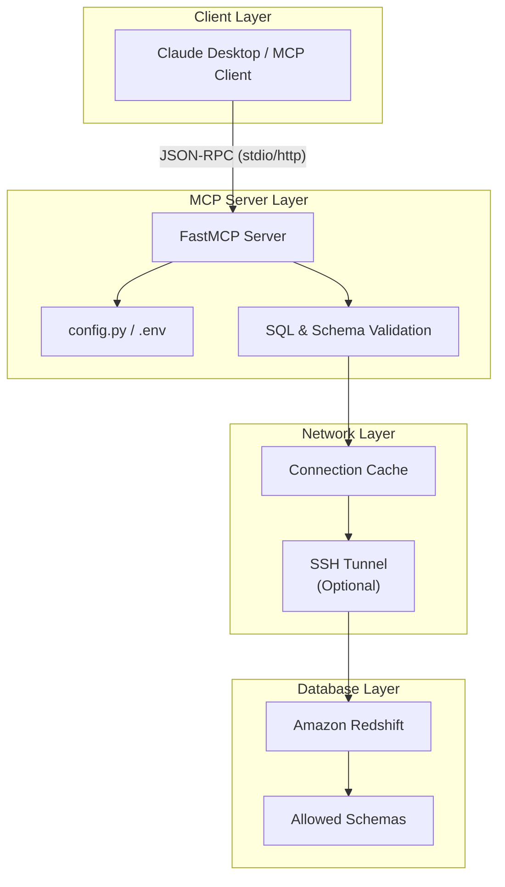

# Redshift MCP Server

This MCP (Model Context Protocol) server provides secure, read-only access to Amazon Redshift databases for use with Claude Desktop and other MCP-compatible clients. It acts as an intelligent bridge, empowering AI assistants to independently navigate, understand, and extract insights directly from your data warehouse.

## ✨ Key Features

- **10 Specialized Tools**: A full suite of tools for data discovery, metadata extraction, querying, and exporting.
- **Dynamic Configuration**: Fully configurable via `.env` (allowlists, row limits, connection parameters).
- **Transport Modes**: Supports both `stdio` (for local clients like Claude Desktop) and modern `streamable-http` (Streamable HTTP over `/mcp` for remote connections).
- **Connection Caching**: Efficient connection management with single long-lived health-checked connections to Redshift.
- **Enterprise Security**: 
  - Strictly read-only SQL validation.
  - Schema allowlisting (restricts AI to pre-approved schemas).
  - Hard caps on query and export row counts to protect database performance.
- **SSH Tunnel Support**: Connects seamlessly to private VPC Redshift clusters via an integrated `sshtunnel`.

## 🛠️ MCP Tools Available

### Data Discovery & Navigation
1. **`get_allowed_schemas`**: Return the server's schema access configuration (allowlist, default schema, limits).
2. **`list_schemas`**: Discover accessible schemas in the database (filtered by the configured allowlist).
3. **`list_tables`**: List all tables in a schema. Only schemas in the allowlist are accessible.
4. **`describe_table`**: Get column names, data types, nullability, and defaults for a table.
5. **`search_columns`**: Search for columns whose name matches a keyword (case-insensitive) across all tables in allowed schemas.

### Data Analysis & Extraction
6. **`sample_data`**: Return a quick sample of rows from a table for data exploration.
7. **`table_row_count`**: Get the exact row count for a table using `COUNT(*)`.
8. **`query_data`**: Run a read-only `SELECT` query. Automatically wraps and limits results based on server configuration.
9. **`explain_query`**: Show the `EXPLAIN` plan for a query to understand performance before executing.
10. **`export_to_csv`**: Export query results to CSV format with a higher dedicated row limit (`MAX_EXPORT_ROWS`).

## 🚀 Setup & Installation

### 1. Install Dependencies

```bash
# Clone the repository
git clone <repository-url>
cd redshift-mcp-server

# Create virtual environment
python3 -m venv .venv
source .venv/bin/activate

# Install dependencies
pip install -r requirements.txt
```

### 2. Configure Environment

Copy the example environment file and edit with your credentials:

```bash
cp .env.example .env
```

Edit the `.env` file to configure your Redshift connection and server limits:

```env
# --- Redshift Connection ---
RS_HOST=your-cluster.region.redshift.amazonaws.com
RS_DB=your_database_name
RS_USER=your_readonly_user
RS_PASS=your_password
RS_PORT=5439

# --- Security & Limits ---
ALLOWED_SCHEMAS=gold_capsaai,report_capsaai
DEFAULT_SCHEMA=gold_capsaai
MAX_ROWS=500
MAX_EXPORT_ROWS=5000

# --- SSH Tunnel (For Private VPCs) ---
SSH_TUNNEL=false
# If true, provide SSH_HOST, SSH_USER, SSH_KEY_FILE, etc.
```

### 3. Start the Server

**Mode 1: `stdio` (Default)**
Best when the MCP Client (e.g. Claude Desktop) is running on the *same machine*.
```bash
python server.py
```


**Mode 2: Streamable HTTP (`/mcp`)**
Best for accessing the server remotely via HTTP or tunnels.
```bash
# Start Streamable HTTP server on port 8000
python server.py --http --host 0.0.0.0 --port 8000
```

## 🔌 Connecting to the Server

### Option A: Local Claude Desktop (stdio)

If your Claude Desktop is running on the same machine as the server, edit your Claude Desktop configuration file:
- **Mac**: `~/Library/Application Support/Claude/claude_desktop_config.json`
- **Windows**: `%APPDATA%\Claude\claude_desktop_config.json`

```json
{
  "mcpServers": {
    "redshift": {
      "command": "/absolute/path/to/redshift-mcp-server/.venv/bin/python",
      "args": ["/absolute/path/to/redshift-mcp-server/server.py"]
    }
  }
}
```

### Option B: Remote Connection (Streamable HTTP with Authentication)

When exposing the server over HTTP/HTTPS, the server enforces authentication using **AWS Cognito OIDC (OAuth 2.1)** and/or **API Key Bearer Token**:

#### Method 1: Using `mcp-remote` with OAuth / OIDC or API Key (Recommended for Claude Desktop)

In your Claude Desktop config (`claude_desktop_config.json`):

**With API Key:**
```json
{
  "mcpServers": {
    "capsa-mcp": {
      "command": "npx",
      "args": [
        "mcp-remote",
        "https://<YOUR_IP_OR_DOMAIN>/mcp",
        "--header",
        "Authorization: Bearer <YOUR_MCP_API_KEY>",
        "--transport",
        "http-only"
      ],
      "env": {
        "NODE_TLS_REJECT_UNAUTHORIZED": "0"
      }
    }
  }
}
```

**With AWS Cognito OAuth / OIDC:**
```json
{
  "mcpServers": {
    "capsa-mcp": {
      "command": "npx",
      "args": [
        "mcp-remote",
        "https://<YOUR_IP_OR_DOMAIN>/mcp"
      ],
      "env": {
        "NODE_TLS_REJECT_UNAUTHORIZED": "0"
      }
    }
  }
}
```

#### Method 2: Direct HTTP Transport with Headers
```json
{
  "mcpServers": {
    "redshift": {
      "type": "http",
      "url": "https://<YOUR_IP_OR_DOMAIN>/mcp",
      "headers": {
        "Authorization": "Bearer <YOUR_MCP_API_KEY_OR_COGNITO_JWT>"
      }
    }
  }
}
```

## 🧪 Testing & Validation

The repository includes a comprehensive testing suite and diagnostic tools:
- **`client.py`**: A CLI client that runs an end-to-end smoke test against all 10 tools.
- **`test_connection.py`**: Basic connectivity validation.
- **`test_restricted_access.py`**: Ensures schema security restrictions are working properly.
- **`monitor_mcp.sh`**: Production-ready monitoring with auto-restart, health checks, and logging.

## 🏗️ Architecture



## 🔐 Security Considerations
- **Read-Only**: The `_validate_read_only_sql` wrapper severely restricts queries to `SELECT` and `EXPLAIN` statements.
- **Limits Engine**: Double `LIMIT` syntax bugs are prevented through regex parsing in `_apply_limit`, guaranteeing large table scans are capped at your `.env` threshold.
- **Schema Isolation**: The AI cannot view or query tables outside the `ALLOWED_SCHEMAS` comma-separated list.
- **Keep Credentials Safe**: Never commit your `.env` or `.json` configuration files to version control. They are ignored in `.gitignore` by default.